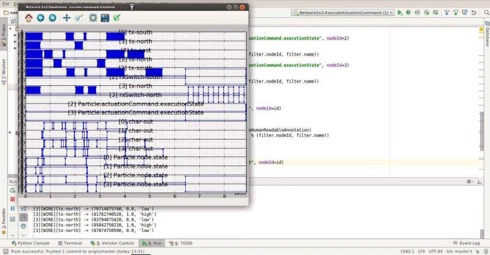

Simulation
==========
The particle platform simulation is built on top of the **Avrora framework**.
It simulates nodes of a network of fold-able chains, that can be used for
shape shifting displays or to build programmable matter in general as
presented by **Matteo Lasagni** in **Force-Guiding Particle Chains for Shape-Shifting Displays** ([http://arxiv.org/abs/1402.2507](http://arxiv.org/abs/1402.2507)).
The simulation constructs and connects multiple nodes to a network that allows bidirectional
communication in between nodes. Each node in the simulation is abstracted by

+ a particle platform,
+ the micro controller (Atmega16), and 
+ the micro controller firmware.

Among others the simulation allows to 

+ inspect registers at runtime, 
+ monitor actions,
+ collect lots of statistics, and
+ log network/node interactions for later usage such as replay for 
visualization or other simulation tools.

### Example video

Build JAR with dependencies
===========================

    mvn assembly:assembly -DskipTests

Start simulation
================

    java -jar ./target/particleplatform-0.0.1-SNAPSHOT-jar-with-dependencies.jar <arguments>
    
**Recommended arguments:**

    -banner=false 
    -status-timing=true 
    -verbose=all 
    -seconds-precision=11 
    -action=simulate 
    -simulation=particle-network 
    -rowcount=2 -columncount=2 
    -seconds=1000E-6 
    -report-seconds=true 
    -platform=particle 
    -arch=avr 
    -clockspeed=8000000 
    -monitors=calls,retaddr,particle,interrupts,memory 
    -dump-writes=true 
    -show-interrupts=true 
    -invocations-only=false 
    -low-addresses=true 
    -particle-log-file=true 
    -particle-facets=state,break,wires 
    -input=elf 
    -throughput=true
    /path_to/node_firmware.elf /optional_path_to/communication_unit_firmware.elf

Network Geometry
================
The network geomertry is defined by *-rowcount=***<rows\>** 
*-columncount=***<columns\>**. With respect to the recommended arguments a simulation
would simulate a **(2 x 2)** network.

**Network** by a (5 x 3) example
---------------------------------

(0,0) 
&nbsp;&nbsp;&nbsp;| 
(1,1) -- (1,2) -- (1,3) 
&nbsp;&nbsp;&nbsp;|&nbsp;&nbsp;&nbsp;&nbsp;&nbsp;&nbsp;&nbsp;&nbsp;&nbsp;&nbsp;&nbsp;|&nbsp;&nbsp;&nbsp;&nbsp;&nbsp;&nbsp;&nbsp;&nbsp;&nbsp;&nbsp;&nbsp;| 
(2,1) &nbsp;&nbsp; (2,2) &nbsp;&nbsp; (2,3) 
&nbsp;&nbsp;&nbsp;|&nbsp;&nbsp;&nbsp;&nbsp;&nbsp;&nbsp;&nbsp;&nbsp;&nbsp;&nbsp;&nbsp;|&nbsp;&nbsp;&nbsp;&nbsp;&nbsp;&nbsp;&nbsp;&nbsp;&nbsp;&nbsp;&nbsp;| 
(3,1) &nbsp;&nbsp; (3,2) &nbsp;&nbsp; (3,3) 
&nbsp;&nbsp;&nbsp;|&nbsp;&nbsp;&nbsp;&nbsp;&nbsp;&nbsp;&nbsp;&nbsp;&nbsp;&nbsp;&nbsp;|&nbsp;&nbsp;&nbsp;&nbsp;&nbsp;&nbsp;&nbsp;&nbsp;&nbsp;&nbsp;&nbsp;| 
(4,1) &nbsp;&nbsp; (4,2) &nbsp;&nbsp; (4,3) 
&nbsp;&nbsp;&nbsp;|&nbsp;&nbsp;&nbsp;&nbsp;&nbsp;&nbsp;&nbsp;&nbsp;&nbsp;&nbsp;&nbsp;|&nbsp;&nbsp;&nbsp;&nbsp;&nbsp;&nbsp;&nbsp;&nbsp;&nbsp;&nbsp;&nbsp;| 
(5,1) &nbsp;&nbsp; (5,2) &nbsp;&nbsp; (5,3) 

The node at address **(0,0)** is the communication unit and optional. It is 
instanciated whenever the arguments provide a second firmware. With the recommended
arguments the simulation would run **/optional_path_to/communication_unit_firmware.elf** program
on the communication unit. Nodes at any address **row > 0 && col > 0** will
run the **/path_to/node_firmware.elf** program according to the recommended arguments.

Logging
=======
**Development logging** an be configured in *log4j.properties". The logfile 
in **/var/tmp/particle-platform-simulation.log** is meant for development purpose.

**Particle logging** is activated by **-particle-log-file=true** and can be found in 
**/tmp/particle-states.log**:

       0  0:00:00.00000037585  WIRE[rx-north] <- high
       0  0:00:00.00000037585  WIRE[rx-south] <- high
       1  0:00:00.00000037585  WIRE[rx-north] <- high
       2  0:00:00.00000037585  WIRE[rx-north] <- high
       2  0:00:00.00000037585  WIRE[rx-south] <- high
       3  0:00:00.00000037585  WIRE[rx-north] <- high
       4  0:00:00.00000037585  WIRE[rx-south] <- high
       0  0:00:00.00000050057  SRAM[SREG.(I | T | H | S | V | N | Z | C)] <- (0b00000000)
       1  0:00:00.00000050057  SRAM[SREG.(I | T | H | S | V | N | Z | C)] <- (0b00000000)
       2  0:00:00.00000050057  SRAM[SREG.(I | T | H | S | V | N | Z | C)] <- (0b00000000)

The register monitored for the output in the example above can be configured in **ParticleStateDescriptoin.json**.

ParticleStateDescriptoin.json
------------------------------

The json object is a description of registers to be monitored. 
It defines 

+ enums, 
+ structures
+ type sizes nd
+ the SRAM address on the microcontroller.

One may use the auto [generator](https://github.com/ProgrammableMatter/cstruct-to-json)
written in python (see full [example](https://github.com/ProgrammableMatter/avrora-particle-platform/blob/master/src/main/resources/ParticleRegisterDescription.json)).

### Obtaining property address for ParticleStateDescriptoin.json
The property address corresponds to the symbol address obtained with 
**readelf -a /path_to/node_firmware.elf** in the symtab minus the offset.
As an example address of the symbol **ParticleAttributes**

    38: 00800061    17 OBJECT  GLOBAL DEFAULT    2 ParticleAttributes

is: 

    0x00800061 - 0x00800000 = 97

Future Work
===========

* For communication from/to particle nodes the Avrora's [serial monitor](http://compilers.cs.ucla.edu/avrora/help/serial.html)
(*edu.ucla.cs.compilers.avrora.avrora.monitors.SerialMonitor*) may be utilized.
* [Energy profiling](http://compilers.cs.ucla.edu/avrora/help/energy-profile.html) is to be implemented for the platform's off chip devices.
